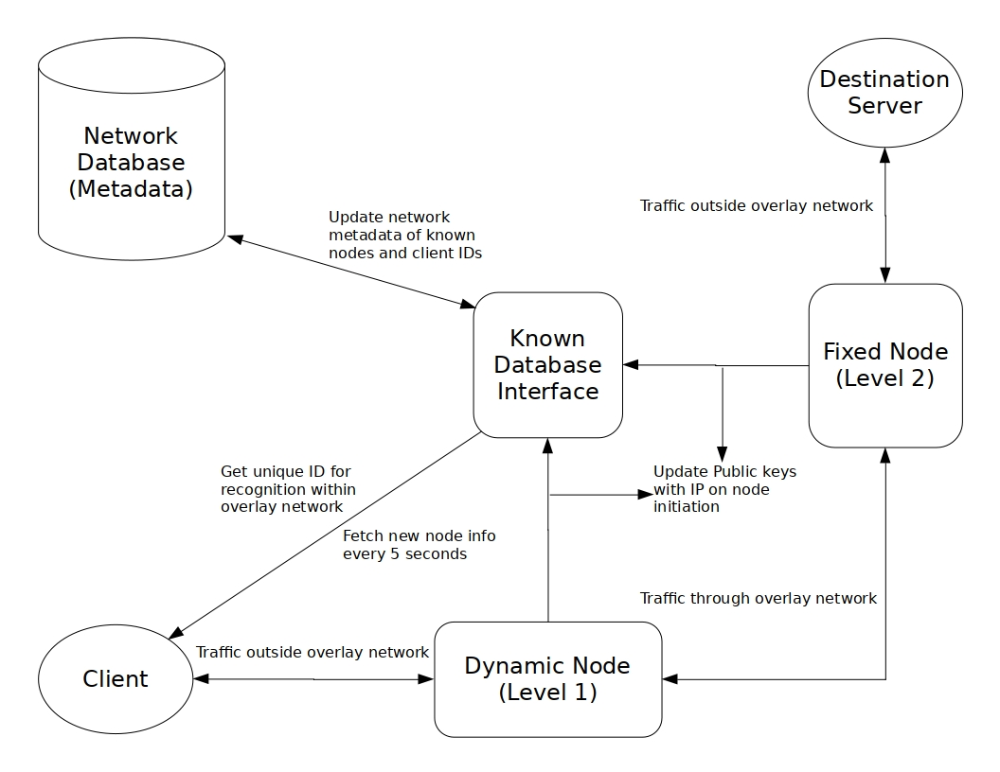

# Dynamic Anonymity Protocol

#### Introduction
A Protocol designed to __augment the current Tor overlay netowrk__ with just __two hops instead of three__, thus mitigating multiple encryption layers and imporving the efficiency.
This protocol also mitigates the __tor node hijack problem__ as it randomly introduces new nodes every five seconds in the relay circuit dynamically replacing the old ones.

#### Highlights
* It uses just 2 hops thus, just 2 layers of encryption
* The Node connected to client is randomly selected every 5 seconds
* The Network has no register of the client, thus there is no way to leak any IP
* The first node just knows the source/client, not the destination
* The Second node knows just the destination, not the source node
* Securty by Compartmentalization model
* Still a proof of concept

#### Architecture


#### Dependencies
* Mysql
* GNU GCC
* GNU Make

#### Compilation
```bash
#build
make
```
All the binaries are available in bin/ with respective arguments
